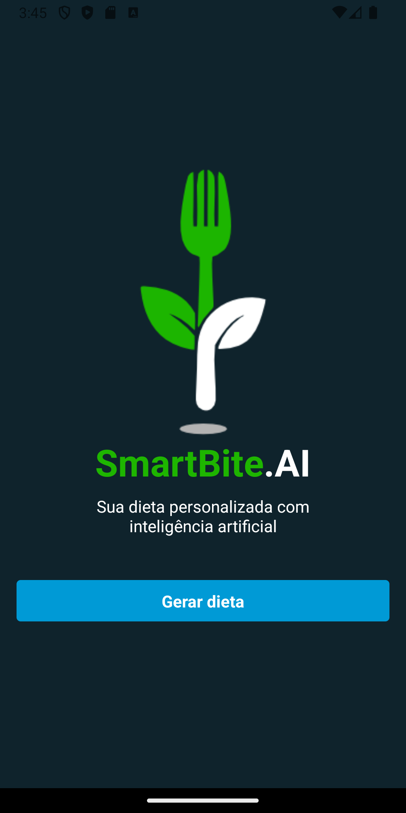
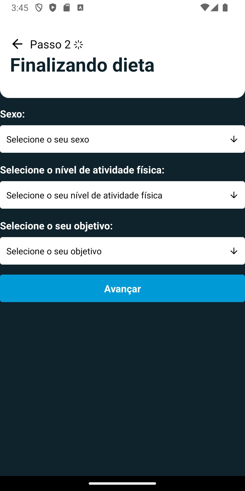
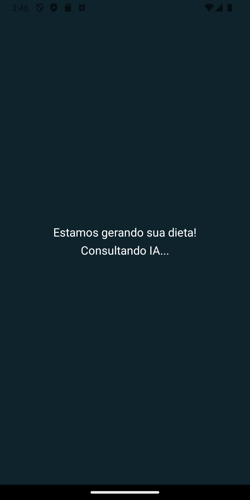
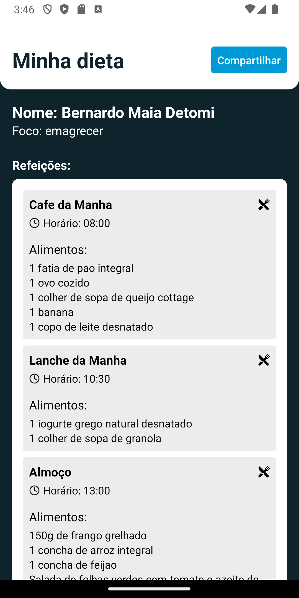
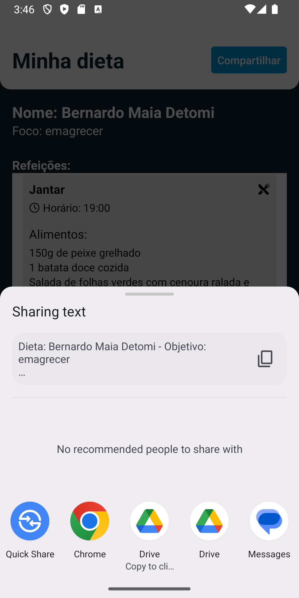
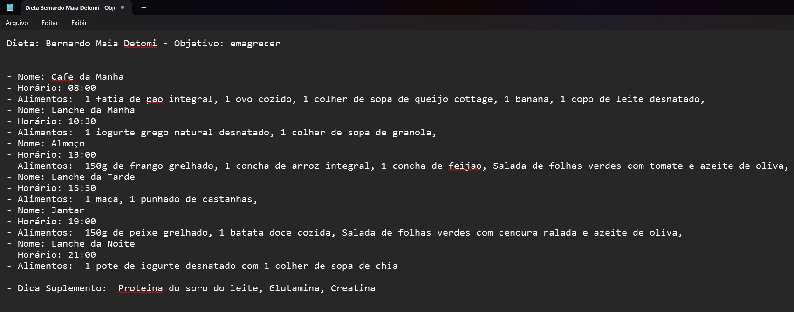

# 📱 SmartBite.AI

Seja bem-vindo ao **SmartBite.AI**, o aplicativo inteligente desenvolvido por Bernardo Maia Detomi no curso do SujeitoProgramador que gera dietas personalizadas usando IA, baseado no seu perfil e metas! 🍽️✨

## 🚀 Funcionalidades Principais

1. **Tela Inicial**: 
   - Exibe a logo do aplicativo e um botão "Gerar Dieta" para começar.
2. **Formulário de Dados Pessoais**:
   - Preencha seu nome, peso, altura e idade.
3. **Escolhas Personalizadas**:
   - Selecione o seu sexo, nível de atividade física e objetivo (emagrecimento, hipertrofia, hipertrofia+definição ou definição).
4. **Tela de Geração de Dieta**:
   - Veja a dieta completa, personalizada com base nas informações fornecidas.
   - A dieta inclui: Nome, Objetivo, Refeições e Dicas de Suplementos.
   - Botão para compartilhar a dieta em formato `.txt` e opção de gerar uma nova dieta.

## 🖼️ Layout do Aplicativo

### Tela 1 - Tela Inicial


### Tela 2 - Formulário de Dados Pessoais


### Tela 3 - Escolhas Personalizadas


### Tela 3.5 - Gerando dieta


### Tela 4 - Dieta Gerada


### Tela 5 - Compartilhando dieta


### Tela 6 - Arquivo gerado


## 🛠️ Tecnologias Utilizadas

- **Expo**: Framework para desenvolvimento React Native.
- **React Native**: Para construção da interface de usuário.
- **JavaScript/TypeScript**: Linguagem utilizada no desenvolvimento.
- **AI**: Para gerar dietas personalizadas.

## 📦 Instalação e Uso

1. Clone este repositório:
   ```bash
   git clone https://github.com/BernardoDetomi/AppDieta.git

2. Instale as dependências:

   ```bash
   npm install
   ```

3. Inicie o projeto:

   ```bash
    npx expo start
   ```

4. Escaneie o QR code no Expo Go para testar no dispositivo físico.  

In the output, you'll find options to open the app in a

- [development build](https://docs.expo.dev/develop/development-builds/introduction/)
- [Android emulator](https://docs.expo.dev/workflow/android-studio-emulator/)
- [iOS simulator](https://docs.expo.dev/workflow/ios-simulator/)
- [Expo Go](https://expo.dev/go), a limited sandbox for trying out app development with Expo

You can start developing by editing the files inside the **app** directory. This project uses [file-based routing](https://docs.expo.dev/router/introduction).  

## 📤 Compartilhamento de Dieta  

Após a geração da dieta, é possível compartilhá-la com um botão que gera um arquivo `.txt` com todos os detalhes da dieta personalizada, incluindo refeições e dicas de suplementação! 📄  

## 🆘 Suporte  

Se você encontrar algum problema ou tiver dúvidas, sinta-se à vontade para abrir uma issue no repositório ou entre em contato:  

- **Email**: bernardomd01@gmail.com 
- **Twitter**: @Bernardo_MD  
- **Instagram**: @bernardoo.md  

## Contribuições  

Contribuições são bem-vindas! Sinta-se à vontade para contribuir com novas funcionalidade para o SmartBite.AI e para abrir problemas (issues) ou enviar pull requests com melhorias! Toda ajuda é bem-vinda.    

## Autores  
 
- Bernardo Maia Detomi.